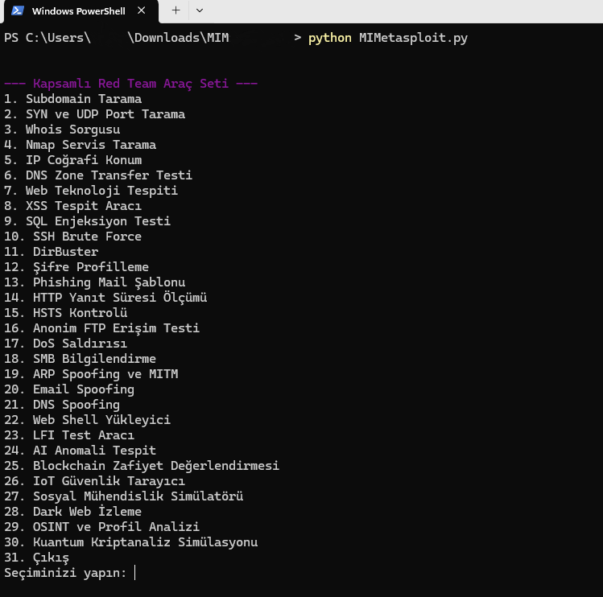
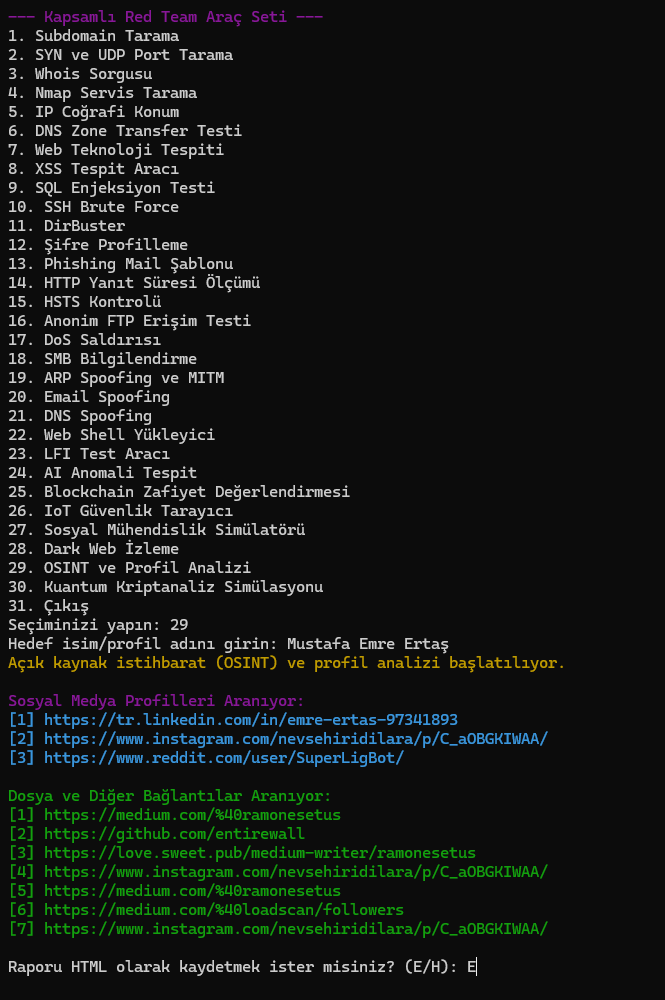
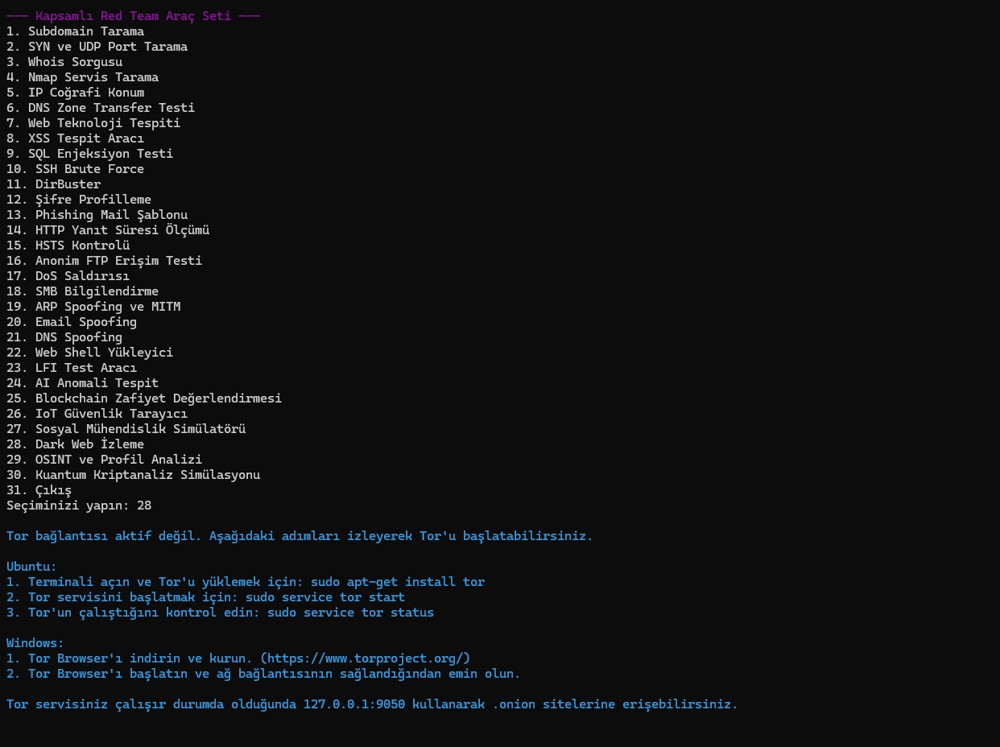
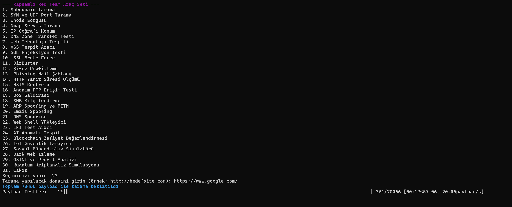
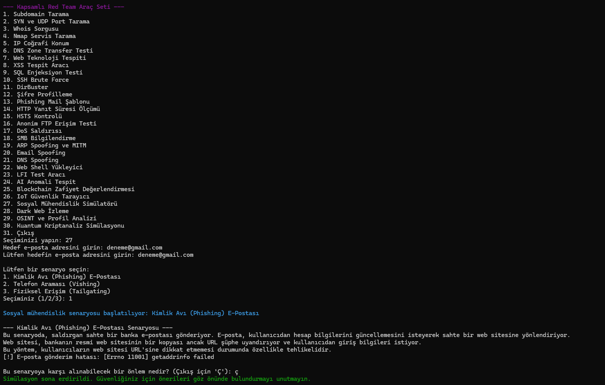
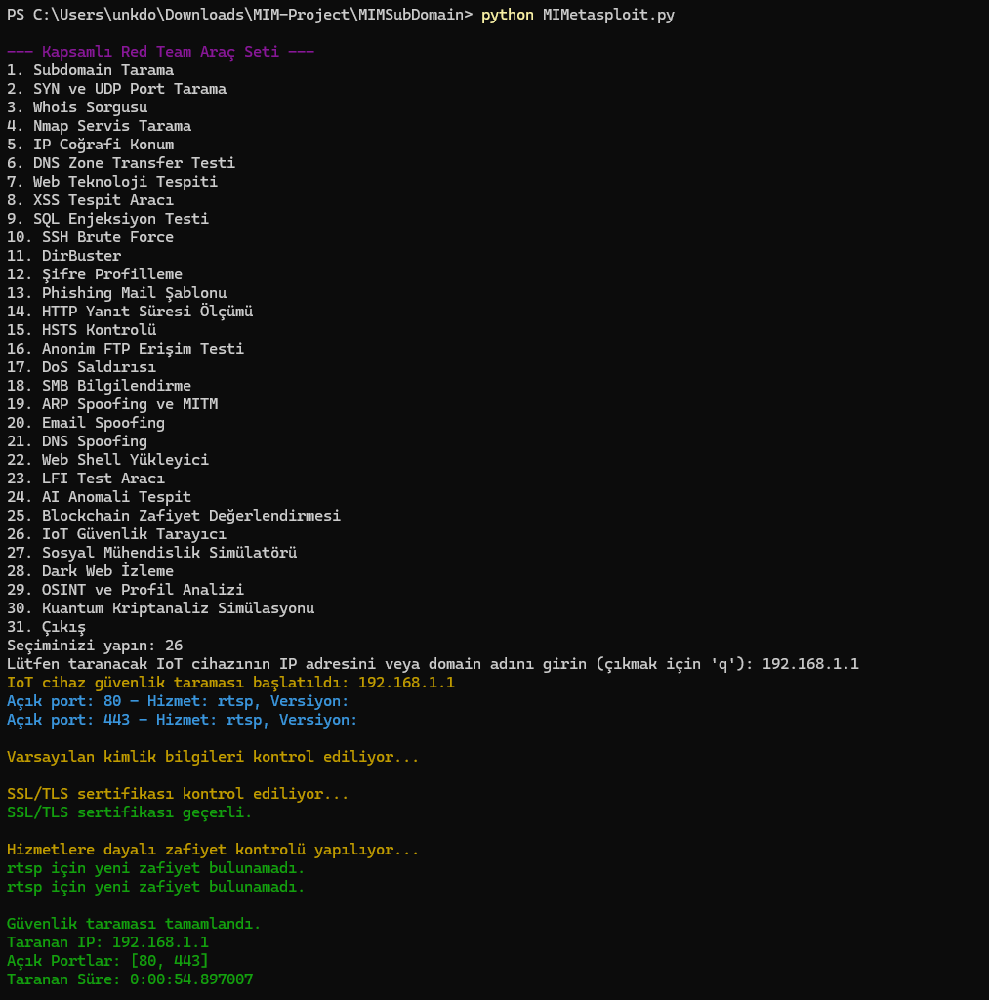
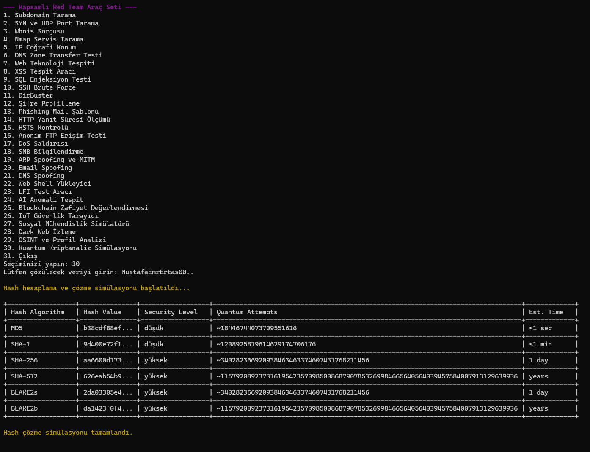

# Kapsamlı Red Team Araç Seti



## Proje Tanıtımı
Kapsamlı Red Team Araç Seti, kullanıcıların etkili bir şekilde Red Team çalışmaları yapmasını sağlayan güçlü ve kapsamlı bir araç koleksiyonudur. Program, siber güvenlik uzmanlarının ihtiyaçlarını karşılamak için çeşitli araçları bir araya getirmiştir. Zaman içinde yeni özellikler eklenerek sürekli güncellenecektir.

### Program Özellikleri
1. Subdomain Tarama
2. SYN ve UDP Port Tarama
3. Whois Sorgusu
4. Nmap Servis Tarama
5. IP Coğrafi Konum
6. DNS Zone Transfer Testi
7. Web Teknoloji Tespiti
8. XSS Tespit Aracı
9. SQL Enjeksiyon Testi
10. SSH Brute Force
11. DirBuster
12. Şifre Profilleme
13. Phishing Mail Şablonu
14. HTTP Yanıt Süresi Ölçümü
15. HSTS Kontrolü
16. Anonim FTP Erişim Testi
17. DoS Saldırısı
18. SMB Bilgilendirme
19. ARP Spoofing ve MITM
20. Email Spoofing
21. DNS Spoofing
22. Web Shell Yükleyici
23. LFI Test Aracı
24. AI Anomali Tespit
25. Blockchain Zafiyet Değerlendirmesi
26. IoT Güvenlik Tarayıcı
27. Sosyal Mühendislik Simülatörü
28. Dark Web İzleme
29. OSINT ve Profil Analizi
30. Kuantum Kriptanaliz Simülasyonu

---

## Kurulum Talimatları

### Gerekli Modüller
Aşağıdaki Python modüllerinin kurulması gerekmektedir:

```
asyncio, aiohttp, requests, random, hashlib, json, ssl, whois, time, logging, nmap, socket, keyboard, smtplib,
urllib3, datetime, re, BeautifulSoup, tqdm, sklearn, concurrent.futures, collections, rich, numpy, tabulate,
colorama, termcolor, scapy, dns
```

### Platformlara Özel Kurulum
#### Windows
1. Python'ı [Python resmi web sitesi](https://www.python.org/) üzerinden indirip kurun.
2. `pip` komutunu kullanarak gerekli modülleri yükleyin:
   ```bash
   pip install -r requirements.txt
   ```
3. **Nmap** uygulamasını indirin ve yükleyin:
   - [Nmap İndir](https://nmap.org/download.html)
   - Kurulumdan sonra, `PATH` ortam değişkenine Nmap'in kurulu olduğu dizini ekleyin.

#### Ubuntu/Debian
```bash
sudo apt update
sudo apt install python3 python3-pip nmap
pip3 install -r requirements.txt
```

#### Fedora
```bash
sudo dnf install python3 python3-pip nmap
pip3 install -r requirements.txt
```

#### MacOS
```bash
brew install python3 nmap
pip3 install -r requirements.txt
```

#### Termux (Android)
```bash
pkg update
pkg install python nmap
pip install -r requirements.txt
```

---

## Program Kullanımı

Gerekli modülleri ve yardımcı uygulamaları yükledikten sonra, aşağıdaki komutla programı çalıştırabilirsiniz:

```bash
python MIMetasploit.py
# veya
py MIMetasploit.py
```

---

## Özel Notlar ve Geliştirme
Bu proje açık kaynaklıdır ve geliştirilmeye açıktır. Zamanla yeni özellikler eklenecek ve mevcut araçlar optimize edilecektir.

### Proje İçerik Örnekler


### OSINT ve Profil Analizi



### Dark Web İzleme



### LFI TARAMA



### Sosyal Mühendislik Simülatörü



### IoT Güvenlik Tarayıcı



### Blockchain Zafiyet Değerlendirmesi



---

## Bağış Yapma

Bu projeye destek olmak için, lütfen bağışlarınızı "TÜRK SİLAHLI KUVVETLERİ" adına yapınız.

### TÜRK SİLAHLI KUVVETLERİ HESAP BİLGİLERİ

#### YURTİÇİ BAĞIŞ İÇİN:

| TL HESAPLARIMIZ                                      | HESAP NUMARASI      | IBAN NUMARASI                             |
|-----------------------------------------------------|---------------------|------------------------------------------|
| T.İŞ BANKASI ÇANKAYA ŞUBESİ                         | 810000              | TR84 0006 4000 0014 2380 8100 00        |
| AKBANK BAŞKENT KURUMSAL ŞUBESİ                      | 8888                | TR59 0004 6008 3288 8000 0088 88        |
| T.C. ZİRAAT BANKASI ANKARA KAMU KURUMSAL ŞUBESİ    | 6031741-5039       | TR07 0001 0017 4506 0317 4150 39        |
| ZİRAAT KATILIM BANKASI A.Ş. KIZILAY ANKARA ŞUBESİ  | 57968-1             | TR13 0020 9000 0005 7968 0000 01        |
| VAKIF KATILIM BANKASI A.Ş. ANKARA ŞUBESİ            | 198700              | TR68 0021 0000 0001 9870 0000 01        |
| GARANTİ BANKASI MALTEPE ŞUBESİ                      | 6297083             | TR71 0006 2000 1140 0006 2970 83        |
| HALK BANKASI ANKARA KURUMSAL ŞUBESİ ()              | 16001987            | TR37 0001 2009 4520 0016 0019 87        |
| HALK BANKASI ANKARA KURUMSAL ŞUBESİ ()              | 16000007            | TR50 0001 2009 4520 0016 0000 07        |
| TEB ANKARA ŞUBESİ                                   | 67198571            | TR13 0003 2000 0000 0067 1985 71        |
| T.VAKIFLAR BANKASI MERKEZ ŞUBE ()                 | 00158007306454209   | TR55 0001 5001 5800 7306 4542 09        |
| T.VAKIFLAR BANKASI MERKEZ ŞUBE ()                 | 00158007296114497   | TR71 0001 5001 5800 7296 1144 97        |

#### YURTDIŞI BAĞIŞ İÇİN:

| USD HESAPLARIMIZ                                     | HESAP NUMARASI      | IBAN NUMARASI                             |
|-----------------------------------------------------|---------------------|------------------------------------------|
| T.İŞ BANKASI ÇANKAYA ŞUBESİ                         | 3910000             | TR85 0006 4000 0024 2383 9100 00        |
| T.C. ZİRAAT BANKASI ANKARA KAMU KURUMSAL ŞUBESİ    | 6031741-5052       | TR44 0001 0017 4506 0317 4150 52        |

| EUR HESAPLARIMIZ                                     | HESAP NUMARASI      | IBAN NUMARASI                             |
|-----------------------------------------------------|---------------------|------------------------------------------|
| T.İŞ BANKASI ÇANKAYA ŞUBESİ                         | 4080000             | TR28 0006 4000 0024 2384 0800 00        |
| T.C. ZİRAAT BANKASI ANKARA KAMU KURUMSAL ŞUBESİ    | 6031741-5065       | TR81 0001 0017 4506 0317 4150 65        |

---

### Lisans
Bu proje açık kaynaklı bir çalışma olup herhangi bir lisansa sahip değildir. Herkesin kullanımına açıktır.
